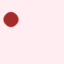
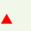
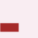
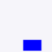

# CS501

This repository contains all relevant code for my CS501 project. It consists of two directories. The `singleObjectModel` directory is for generating the dataset with videos containing a single shape and training the corresponding model and the `objAttModel` directory is for generating the dataset with videos with two shapes and training the object attention model.

## About the Datasets

the singleObjectModel dataset contains

- 4,000 train videos
- 1,000 test videos
- 15 total possible answers.

### Example Questions

- _What color is the rectangle?_
- _Does the image contain a triangle?_
- _Is no blue shape present?_
- _What shape does the image contain?_
- _What direction does the shape move?_

### Example Videos









the objAttModel dataset contains

- 4,000 train videos
- 1,000 test videos
- 4 total possible answers.

### Example Questions

- _What direction does the circle move?_
- _Does direction does the blue shape move?_

All videos are 64x64 RBG .gifs with 10 frames.

## Generating the Datasets

Each directory has a pre-generated dataset, but the datasets can be regenerated by running

```shell
python3 gen_data/generate_data.py
```

from either the `singleObjectModel` or `objAttModel` directories.

If you want to generate a larger dataset or generate videos with a different number of frames, simply modify the `NUM_TRAIN` and `NUM_TEST` or `NUM_FRAMES` constants in `singleObjectModel/gen_data/generate_data.py` and `objAttModel/gen_data/generate_data.py`.

## Training the Models

To train either model use,

```shell
python3 train.py --use-data-dir
```

within the directory of whichever model you want to train.
