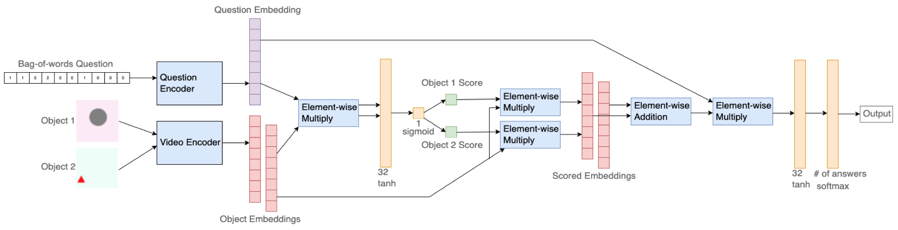

# CS501

This repository contains all relevant code for my CS501 project. In this project, I expanded on the [easy-VQA dataset](https://github.com/vzhou842/easy-VQA) to create a new dataset of simple, short-length videos and corresponding questions and answers about them. Each video consists of basic shapes such as a circle, triangle, or rectangle of varying colors moving in one of four directions for the duration of the video. Additionally, I implemented two models to perform VQA on two differnt types of videos. The first model answers questions about videos that contain a single shape and is found in the `singleObjectModel` directory. The second model performs VQA on videos that contain two shapes and is found in the `objAttModel` directory. Each of these directories contains the corresponding model's structure and dataset, as well as the code for regenerating either dataset.

## About the Datasets

the singleObjectModel dataset contains

- 4,000 train videos
- 1,000 test videos
- 15 total possible answers.

### Example Questions

- _What color is the rectangle?_
- _Does the image contain a triangle?_
- _Is no blue shape present?_
- _What shape does the image contain?_
- _What direction does the shape move?_

### Example Videos


the objAttModel dataset contains

- 4,000 train videos
- 1,000 test videos
- 4 total possible answers.

### Example Questions

- _What direction does the circle move?_
- _Does direction does the blue shape move?_

All videos are 64x64 RBG .gifs with 10 frames.

## Generating the Datasets

Each directory has a pre-generated dataset, but the datasets can be regenerated by running

```shell
python3 gen_data/generate_data.py
```

from either the `singleObjectModel` or `objAttModel` directories.

If you want to generate a larger dataset or generate videos with a different number of frames, simply modify the `NUM_TRAIN` and `NUM_TEST` or `NUM_FRAMES` constants in `singleObjectModel/gen_data/generate_data.py` and `objAttModel/gen_data/generate_data.py`.

## About the Models

To train either model use,

```shell
python3 train.py --use-data-dir
```

within the directory of whichever model you want to train. When either model finishes training, they will create an epoch-loss and epoch-accuracy plot of the training history as well as a confusion matrix of the model's predictions on the test set after training. These plots will be saved as `model_loss.png`, `model_accuracy.png`, and `confusion_matrix.png` respectively.

### The single object model

The single object model, found in the `singleObjectModel` directory, is composed of a video encoder, a question encoder, and a merge module that combines the outputs from the video and question encoder.
The video encoder is a CNN that is composed of alternating Conv3D and MaxPooling3D layers, from which the result is flattened and passed through a Dense layer to obtain the video embedding of length 32. Additionally, a Dropout layer that drops 40% of the outputs from the Dense layer is necessary to reduce overfitting.
The question encoder takes the question about the video as a bag-of-words and feeds it through two Dense layers to get the question embedding of length 32.
These two embeddings are then merged through element-wise multiplication before being pased through two more Dense layers with the final layer using the softmax activation function that provides the final output of the network.
This model is capable of achieving an accuracy of ~95%.

### The object attention model

The object attention model, found in the `objAttModel` directory, is trained on a dataset of videos with two shapes in each video rather than just one. The questions in this dataset always refer to just one of the shapes in a video and thus require the model to be able to discern which shape the question is asking about before answering the question. The two shapes in any given video will have a different shape and color and move in a different direction from each other.
This added complexity requires a different model to be able to accurately answer the questions in the dataset. That model is the object attention model. This model first assumes that the video input is passed through an object detector that perfectly segments the two shapes in each video. The input to this model is then two videos, each with one of the shapes unchanged and the other shape removed. The input to the model is the two videos, one for each object, and the question represented as a bag-of words.
The object attention model reuses the video and question encoder modules from the single object model to get an embedding for each of the videos and the question. The video embeddings are then seperately combined with the question embedding via element-wise multiplication. The combined question and video embeddings are then run through a series of dense layers with the last dense layer being a single neuron with the sigmoid activation function. The output of this neuron corresponds to a ”score”, or how likely it is that the question is asking about that particular video. These scores are then multiplied by their corresponding video embedding obtained previously. The idea is that the video/object that the question is asking about should have a score close to 1, so multiplying its embedding by the score should not change the values very much, and the video/object that the question is not asking about should have a score close to 0, so the values in its embedding should become very low. After the video embeddings have been multiplied by their corresponding scores they are then combined using element-wise addition. This vector is then combined with the question embedding obtained previously via element-wise multiplication before being passed through a dense layer of 32 neurons and then finally a softmax layer, which is the final output of the model. The structure of the object attention model is diagrammed below.


## Project Structure
```
project
│   README.md
│   obj_att_model.png
│
└───singleObjectModel
│   │   model.py
│   │   prepare_data.py
│   │   train.py
│   │   etc
│   │
│   └───gen_data
│   │   │   generate_data.py
│   │   │   etc
│   │   │  
│   └───data
│   │   │   answers.txt
│   │   └───train
│   │   │   │   questions.json
│   │   │   └───videos
│   │   │   │   │   0.gif
│   │   │   │   │   1.gif
│   │   │   │   │   2.gif
│   │   │   │   │   ...
│   │   │  
│   │   └───test
│   │   │   │   questions.json
│   │   │   └───videos
│   │   │   │   │   0.gif
│   │   │   │   │   1.gif
│   │   │   │   │   2.gif
│   │   │   │   │   ...
│   
└───objAttModel
│   │   model.py
│   │   prepare_data.py
│   │   train.py
│   │   etc
│   │
│   └───gen_data
│   │   │   generate_data.py
│   │   │   etc
│   │   │  
│   └───data
│   │   │   answers.txt
│   │   └───train
│   │   │   │   questions.json
│   │   │   └───videos
│   │   │   │   └───video0
│   │   │   │   │   │   0.gif
│   │   │   │   │   │   1.gif
│   │   │   │   └───video1
│   │   │   │   └───video2
│   │   │   │   ...
│   │   │  
│   │   └───test
│   │   │   │   questions.json
│   │   │   └───videos
│   │   │   │   └───video0
│   │   │   │   │   │   0.gif
│   │   │   │   │   │   1.gif
│   │   │   │   └───video1
│   │   │   │   └───video2
│   │   │   │   ...
│   
```
